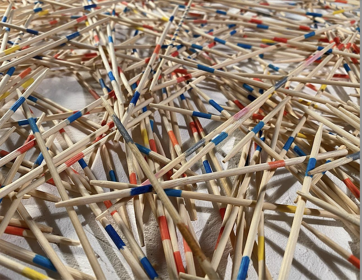

# Friend, I welcome you to my page!

A couple of years ago I crafted the following approach to life: _What doesn't seem ambivalent needs further examination._ It seems to me that this should make a quite suitable motto for learning how to code as well.

## I deal with

- Web Development (lately) :magic_wand:
- Interactive Art Projects :slot_machine:
- the Best Coffee in Town (in my kitchen) :coffee:

