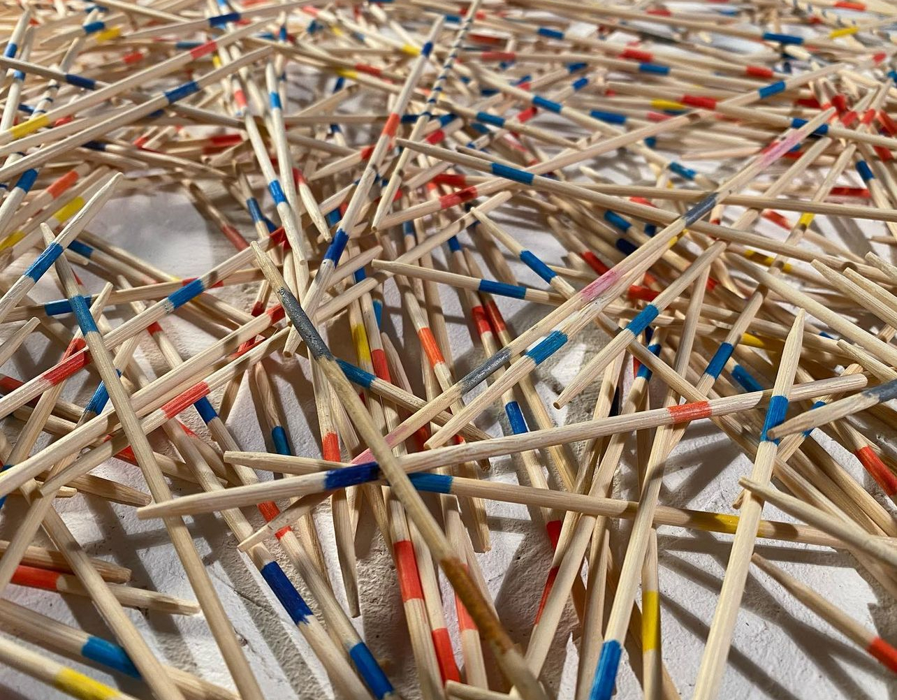

# Friend, I welcome you to my page!

A couple of years ago I crafted the following approach to life: What doesn't seem ambivalent needs further examination. It seems to me that this should make a quite suitable motto for learning how to code as well.

## I deal with

- Web Development (lately)
- Interactive Art Projects
- the Best Coffee in Town (in my kitchen)
